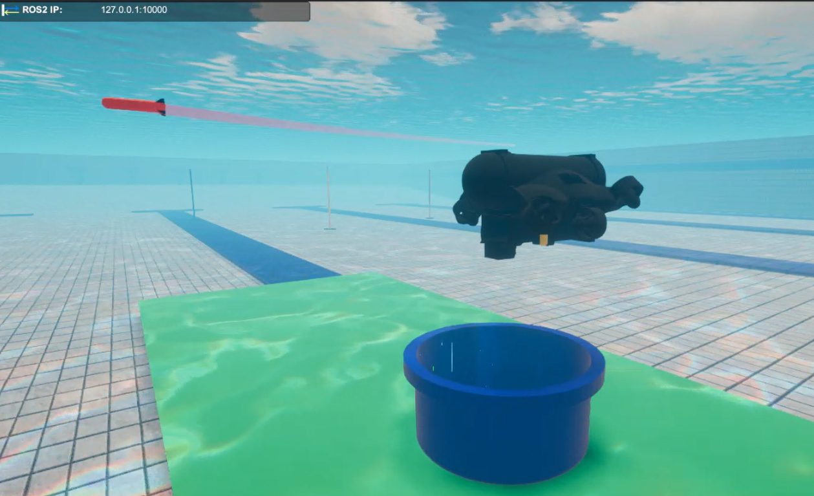

# UnitySim for underwater robotics

## Introduction

UnitySim is a simulation environment for underwater robotics, created to test out autonomous algorithms before they are deployed on real vehicles. It is developed by [Mecatron](https://mecatron.sg/) to simulate AUV competitions such as the Singapore AUV Challenge and RoboSub. Future support for other types of vehicles such as surface vessels and aerial drones is only possible if there are more contributors to the project.

## Features

### Sensors

UnitySim comes with a suite of sensors commonly found in robotics; these sensors can be found in the package `UnitySensors`.
- IMU
- Depth, heading sensor
- Camera
- Depth camera
- Pose (for ground truth)  

Other specialized sensors such as sonar and underwater depth camera are still in development.

### Controllers and actuators

This simulator **emulates** the physics of underwater vehicles, but does not simulate the hydrodynamics. The vehicle is modelled as a rigid body with 6 degrees of freedom, and the thrusters are modelled as forces and torques applied to the rigid body. The physics engine used is Unity's built-in PhysX engine. 

It also **emulates** `mavros`, which is a ROS package typically used for the ArduPilot family of autopilots. This means that you do not need to plug in a real autopilot or run a SITL, but the simulator will behave as if there is a real autopilot running. The vehicle can be controlled through `mavros` topics and services, just like a real vehicle.

UnitySim also has actuators which are specifically designed for Mecatron's AUV, for SAUVC and RoboSub competitions:
- Torpedo launcher
- Marker dropper

### ROS2 integration

UnitySim has built-in support for ROS2. This allows for seamless integration between Unity and ROS2, allowing users to leverage the power of ROS2 for their autonomous algorithms.

## Tutorials

### - [Tutorial 1: Installing as a developer](docs/install_as_developer.md)
### - [Tutorial 2: Download as user](docs/download.md)

Guides for adding custom vehicles, sensors, and environments will come when there are more contributors to the project.

## Acknowledgements

**Author**: [Tien Luc Vu](https://www.linkedin.com/in/luc-vu-tien-601138131/) ([Mecatron Underwater Robotics](https://mecatron.sg/), NTUsg)

The project has already installed the following Unity packages and would like to thank the authors of these packages:

- Water graphics: [Crest Water 4 HDRP](https://crest.readthedocs.io/en/stable/?rp=hdrp).

- ROS2 integration inside Unity: [ROS-TCP-Connector](https://github.com/Unity-Technologies/ROS-TCP-Connector.git)

- Sensor suite for robotics: [UnitySensors](https://github.com/Field-Robotics-Japan/UnitySensors.git)

- Built-in object detection and segmentation: [com.unity.perception](https://github.com/Unity-Technologies/com.unity.perception)

On the local ROS side, the following package is used:
- [ROS-TCP-Endpoint](https://github.com/Unity-Technologies/ROS-TCP-Endpoint)

