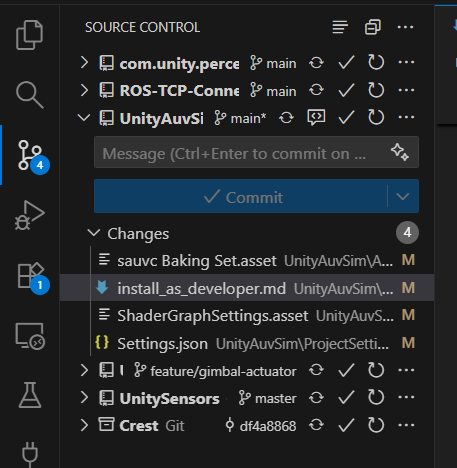

## Dev guide

Welcome to behind the scene, where magic happens and robots come to life! This guide will walk you through the installation and setup process for developers who want to contribute to the UnitySim project. Thank you so much for being part of this exciting journey!

If you just want to run the simulation, please refer to the [download guide](download.md).

**Table of Contents**
- [Project structure](#project-structure)
- [Installation steps](#installation-steps)
- [Opening the project in Unity](#opening-the-project-in-unity)
- [Recommended development workflow](#recommended-development-workflow)
- [Git notes](#git-notes)

### Project structure

This is a comprehensive Unity simulation platform that integrates multiple specialized components as Git submodules within the Unity Packages directory:

```
UnityMDS/                       # Core AUV simulation project (this repo)
├── Assets/                        # Unity project assets
│   ├── Images/                   # Image assets
│   ├── Models/                   # 3D models and meshes
│   ├── Perception/               # Labeller for perception camera
│   ├── Resources/                # Runtime loadable assets
│   ├── Samples/                  # Sample assets and scenes
│   ├── Scenes/                   # Unity scene files
│   │   ├── MenuScene.unity      # Main menu scene
│   │   ├── PersistentScene.unity # Persistent scene for global systems
│   │   ├── Sauvc.unity          # SAUVC competition scene
│   │   └── Sauvc/               # SAUVC scene-specific assets
│   ├── Scripts/                  # C# scripts for simulation logic
│   ├── Settings/                 # Project configuration files
│   ├── TextMesh Pro/             # Text rendering system
│   └── UI/                       # UI elements and prefabs
├── Packages/                      # Unity Package Manager dependencies
│   ├── com.mecatron.multi-domain-simulation/  # Multi-domain simulation framework (submodule)
│   ├── com.nwh.common/                        # NWH common utilities (submodule)
│   ├── com.nwh.dynamicwaterphysics/          # Dynamic water physics (submodule)
│   ├── com.unity.perception/                  # Unity ML perception tools (submodule)
│   ├── com.waveharmonic.crest/               # Crest ocean simulation (submodule)
│   ├── ROS-TCP-Connector/                     # ROS communication package (submodule)
│   ├── UnitySensors/                          # Sensor simulation framework (submodule)
│   ├── manifest.json                          # Package manifest
│   └── packages-lock.json                     # Package lock file
├── ProjectSettings/               # Unity project configuration
├── docs/                         # Documentation
├── Library/                      # Unity generated files (auto-generated)
├── Logs/                         # Unity log files (auto-generated)
├── UserSettings/                 # User-specific settings (auto-generated)
├── .gitmodules                   # Git submodule configuration
└── *.csproj, *.sln              # Visual Studio project files (auto-generated)
```

UnityMDS integrates several specialized components as submodules in the Packages directory:

- **com.mecatron.multi-domain-simulation** - Multi-domain simulation framework for complex system modeling
- **com.nwh.common** - NWH common utilities and shared functionality
- **com.nwh.dynamicwaterphysics** - Dynamic water physics simulation
- **com.unity.perception** - Unity's machine learning perception tools for synthetic data generation
- **com.waveharmonic.crest** - Advanced ocean and water graphics simulation (Crest)
- **ROS-TCP-Connector** - ROS communication package for Unity-ROS integration
- **UnitySensors** - Comprehensive sensor simulation package (cameras, sonar, IMU, etc.)

### Installation steps

Please ensure that you have added your SSH key to your GitHub account, as the submodules are cloned via SSH. Please follow online tutorial/GPT to find out how to do so.

Clone the repository and its submodules at a location you prefer:

```
git clone --recurse-submodules git@github.com:NTU-Mecatron/UnityMDS.git
```

If you use other terminals, please adapt and run the commands separately.

The `--recurse-submodules` flag will automatically clone all the submodules in the `Packages` directory, including:
- com.mecatron.multi-domain-simulation
- com.nwh.common
- com.nwh.dynamicwaterphysics  
- com.unity.perception
- com.waveharmonic.crest (Crest ocean simulation)
- ROS-TCP-Connector
- UnitySensors

For future updates of submodules, you will need to recursively update the modules. To make life easy, you can set an alias (aka shortcut):

```
git config --local alias.pullall '!git pull && git submodule update --remote --recursive'
```

then run `git pullall`.

### Opening the project in Unity

After cloning the repository with all its submodules, please open the Unity Hub application, click on "Add", and select the **`UnityMDS`** folder. This will add the project to your Unity Hub.


UnityHub may prompt you to install a specific Unity version if you do not have it installed yet. Please accept.

Upon opening the project for the first time, Unity will take some time to import all the assets and compile the scripts. Please be patient as this may take a few minutes. A lot of warnings may appear in the console, but you can safely press the "Clear" button to clear them all.

Proceed to open any of the scenes available in [Assets/Scenes](../Assets/Scenes). For example, upon opening the [Sauvc.unity](../Assets/Scenes/Sauvc.unity) scene, you should see something like this:


> Note: You may need to enable Unity communication through the firewall manually to enable Ardupilot JSON integration. For Windows, search "Allow an app through Windows Firewall" in the start menu, then find all Unity entries and ensure that both "Private" and "Public" checkboxes are ticked.

### Recommended development workflow

On Windows, many people often use Visual Studio as their IDE for Unity development. If you use this, when you install Visual Studio, please ensure that you have selected the "Game development with Unity" workload. Another option that works on all platforms is Visual Studio Code (VSCode). Please install the C# and Unity extension for VSCode to enable C# support.

To select your preferred IDE, go to `Edit -> Preferences -> External Tools` and select either Visual Studio or VSCode as your external script editor.

To track git changes, since we have multiple packages (submodules) in this project, it is recommended to open the entire `UnityMDS` (the root of the repository) folder as a workspace in VSCode. This way, you can track changes across all submodules in one place, all in VSCode's Source Control tab.



> Note: When you double click on a script in Unity, it will open the script in the context of the UnityMDS project. You can still edit the script, but for comprehensive git management across all submodules, open the entire `UnityMDS` folder as a workspace when you want to track git changes and are ready to commit.

### Git notes

A few things to note regarding git workflow:

1. **Make changes to a prefab, not to the scene**. For example, when you add something into the 'auv' game object, you may temporarily add it in the scene, but please remember to apply the changes to the prefab by clicking on the "Overrides" dropdown and selecting "Apply All". This will ensure that your changes are saved to the prefab asset, not the scene. If you make changes to the scene, it will be hard to track changes in git and will definitely lead to merge conflicts. Your PR will simply be rejected.

2. Open a new branch called `feature/xxx` or `fix/xxx` from the `main` branch when you want to add a new feature. Each branch should only contain one feature or bug fix, and should only contain commits and file changes related to that feature or bug fix. Committing irrelevant changes will lead to your PR being rejected, again.

3. If you are working on multiple features, open multiple branches, one for each feature **all from the `main` branch**. There is an important distinction between branching from `main` and branching from another feature branch. Make sure that all branches are created from `main`. This will make merging and code review much easier.

4. Unity sometimes makes changes to a lot of files which are not related to your feature or bug fix. Please do not commit these, unless you are sure that they are related to your feature or bug fix. If you are unsure, please ask the project manager.

5. Be aware which scripts/components/prefabs should be created in the main project (`UnityMDS`) and which should be created in the packages (e.g., `UnitySensors`). If you are unsure, please ask the project manager.