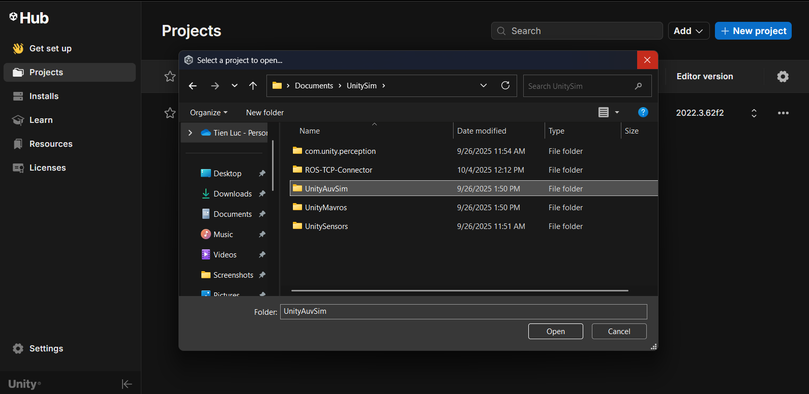
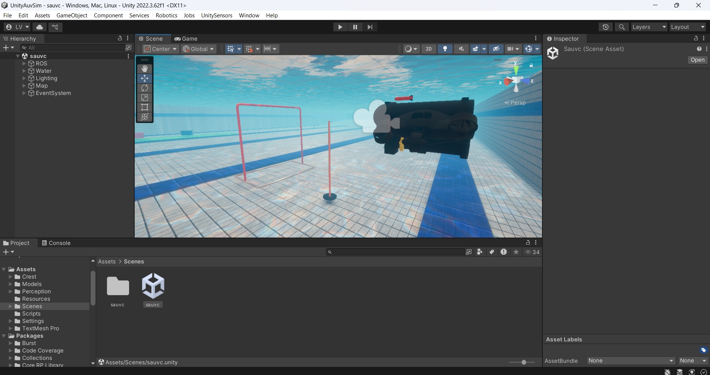

## Dev guide

This guide is for developers who want to modify the Unity project. If you just want to run the simulation, please refer to the [download guide](download.md).

### Project structure

This is a comprehensive Unity simulation platform that integrates multiple specialized components as Git submodules:

```
UnitySim/                           # Overall project structure
├── UnityAuvSim/                   # Core AUV simulation project (this repo)
│   ├── Assets/                    # Unity project assets
│   │   ├── Crest/                # Ocean and water simulation system
│   │   ├── Models/               # 3D models and meshes
│   │   ├── Perception/           # Labeller for perception camera
│   │   ├── Resources/            # Runtime loadable assets
│   │   ├── Scenes/               # Unity scene files
│   │   ├── Scripts/              # C# scripts for simulation logic
│   │   ├── Settings/             # Project configuration files
│   │   └── TextMesh Pro/         # Text rendering system
│   ├── docs/                     # Documentation
│   ├── Library/                  # Unity generated files (auto-generated)
│   ├── Packages/                 # Unity Package Manager dependencies
│   ├── ProjectSettings/          # Unity project configuration
│   └── *.csproj, *.sln          # Visual Studio project files
├── UnityMavros/                   # MAVLink/ROS bridge integration
├── UnitySensors/                  # Sensor simulation framework
├── com.unity.perception/          # Unity ML perception tools
└── .gitmodules                   # Git submodule configuration
```

UnitySim integrates several specialized components:

- **UnityAuvSim** - Main AUV simulation framework and Unity project
- **UnityMavros** - Emulator for Mavros
- **UnitySensors** - Comprehensive sensor simulation package
- **com.unity.perception** - Unity's machine learning perception tools
- **ROS-TCP-Connector** - ROS communication package
- **Crest** - Advanced ocean and water graphics simulation

### Installation steps

Please ensure that you have added your SSH key to your GitHub account, as the submodules are cloned via SSH. Please follow online tutorial/GPT to find out how to do so.

Open a new powershell terminal (Windows) and copy-paste the entire block below to clone the repository and its submodules:

```powershell
cd Documents; mkdir UnitySim; cd UnitySim
git clone --recurse-submodules git@github.com:NTU-Mecatron/UnityAuvSim.git
git clone git@github.com:NTU-Mecatron/UnityMavros.git
git clone git@github.com:NTU-Mecatron/com.unity.perception.git
git clone git@github.com:NTU-Mecatron/ROS-TCP-Connector.git
git clone git@github.com:NTU-Mecatron/UnitySensors.git
```

If you use other terminals, please adapt and run the commands separately.

> Note: We did not put all these submodules inside a single repository because of some bugs regarding Git LFS. You may also run into some warnings regarding Git LFS when cloning `UnitySensors` but you can safely ignore them.

### Opening the project in Unity

After cloning all of them, please open the Unity Hub application, click on "Add", and select the folder **`UnityAuvSim`** inside the `UnitySim` folder you just created. This will add the project to your Unity Hub.



UnityHub will prompt you to install `Editor version 2022.3.62f2`. Please accept and install this version as it is a Long-Term Support (LTS) version. If you already have this version installed, you can skip this step.

Upon opening the project for the first time, Unity will take some time to import all the assets and compile the scripts. Please be patient as this may take a few minutes. A lot of warnings may appear in the console, but you can safely press the "Clear" button to clear them all.

Proceed to open any of the scenes available in the `Assets/Scenes`. For example, upon opening the `sauvc` scene, you should see something like this:

